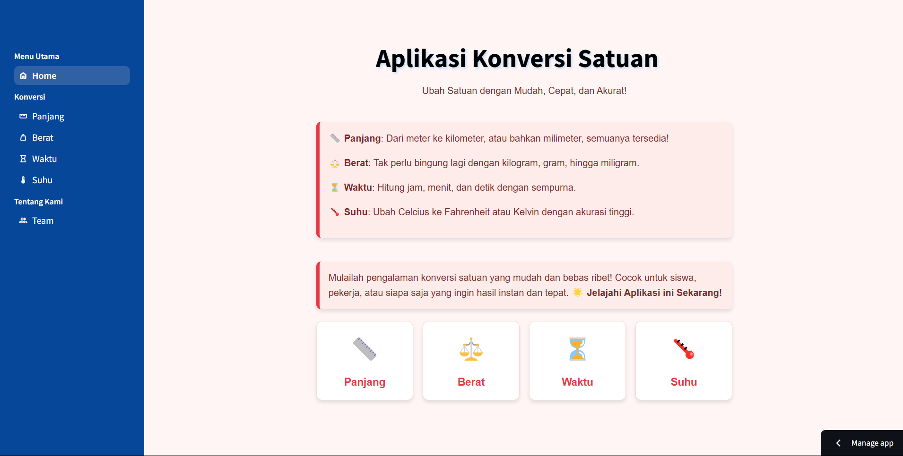

# 🎈 Aplikasi Konversi Satuan

alat digital yang dirancang untuk memudahkan pengguna dalam mengonversi berbagai jenis satuan dengan cepat dan akurat.



## Table of Features

- [Panjang](#panjang)
- [Berat](#berat)
- [Waktu](#waktu)
- [Suhu](#suhu)

[](https://blank-app-template.streamlit.app/)

### How to run it on your own machine

1. Install the requirements

   ```
   $ pip install -r requirements.txt
   ```

2. Run the app

   ```
   $ streamlit run streamlit_app.py
   ```

## Contact Developer

Connect with me! Feel free to reach out for collaboration, job opportunities, or just to say hello.

- **Email:** wahyuyassin@gmail.com
- **Email:** maulashidqic10@gmail.com
- **Email:** @gmail.com
- **Email:** @gmail.com
